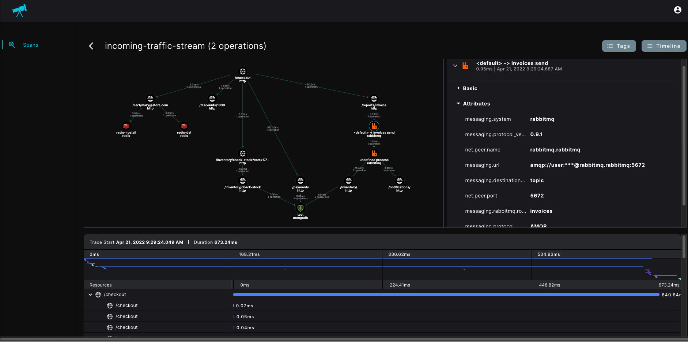

# otel-py
[![PIP Published Version][pip-image]][pip-url]
[![Apache License][license-image]][license-image]
[![Coverage][coverage-image]][coverage-url]



This package provides OpenTelemetry-compliant tracing to Python
applications for the collection of distributed tracing and performance metrics in [Cisco Telescope](https://console.telescope.app/?utm_source=github).

## Contents

- [Installation](#installation)
  - [Install Packages](#install-packages)
  - [Install Dependencies](#install-dependencies)
  - [Library initialization](#library-initialization)
  - [OpenTelemetry Collector Configuration](#opentelemetry-collector-configuration)
  - [Existing OpenTelemetry Instrumentation](#existing-opentelemetry-instrumentation)
- [Supported Runtimes](#supported-runtimes)
- [Supported Libraries](#supported-libraries)
- [Configuration](#configuration)
- [Getting Help](#getting-help)
- [Opening Issues](#opening-issues)
- [License](#license)

## Installation

### Requirements

`Python >=3.8, <4.0`
`pip3 >= 22.0` 

### Install packages
> To install Cisco OpenTelemetry Distribution simply run:

```sh
pip install cisco-telescope
```

### Install dependencies
To install all supported instrumentation frameworks run:
```sh
telescope-bootstrap
```


### Library initialization
Cisco OpenTelemetry Distribution is activated and instruments the supported libraries once the `ciscoTracing.init()` has returned.

To initialize the library, you'll need a cisco-token, which is taken from your [Account tab on the Telescope console Settings page](https://console.telescope.app/settings/account).


```python
from cisco_telescope import tracing

tracing.init(
  service_name="<your-service-name>",
  cisco_token="<your-cisco-token>"
)
```

### OpenTelemetry Collector Configuration

By default, Cisco OpenTelemetry Distribution exports data directly to [Cisco Telescope's](https://console.telescope.app/?utm_source=github) infrastructure backend.
**Existing** OpenTelemetery Collector is supported, the following configuration can be applied

#### Configure custom trace exporter

Cisco OpenTelemetry Distribution supports the configuration of multiple custom exporters. Note that you will need to handle your exporter authorization.
Example for creating OtlpGrpc Span exporter to local OpenTelemetry collector:

```python
from cisco_telescope import tracing, options

tracing.init(
  service_name="<your-service-name>",
  exporters=[
    options.ExporterOptions(
      exporter_type="otlp-grpc",
      collector_endpoint="grpc://localhost:4317"
    ),
  ]
)

```

#### Configure custom OpenTelemetry collector to export trace data to [Cisco Telescope's](https://console.telescope.app/?utm_source=github) external collector.

```yaml
collector.yaml ...

exporters:
  otlphttp:
    traces_endpoint: https://production.cisco-udp.com/trace-collector
    headers:
      authorization: Bearer <Your Telescope Token>
    compression: gzip


service:
  pipelines:
    traces:
      exporters: [otlphttp]
```

### Existing OpenTelemetry Instrumentation

> Notice: Only relevant if interested in streaming existing OpenTelemetry workloads.
> [Cisco Telescope](https://console.telescope.app/?utm_source=github). supports native OpenTelemetery traces.
```python
from opentelemetry import trace
from opentelemetry.sdk.resources import Resource
from opentelemetry.sdk.trace import TracerProvider
from opentelemetry.sdk.trace.export import BatchSpanProcessor

from opentelemetry.exporter.otlp.proto.http.trace_exporter import (
    OTLPSpanExporter as OTLPHTTPExporter,
)

provider = TracerProvider(resource=Resource.create())
trace.set_tracer_provider(provider)

http_exporter = OTLPHTTPExporter(
  endpoint="https://production.cisco-udp.com/trace-collector",
  headers= {
    "authorization": "Bearer <Your Telescope Token>",
  },
)

processor = BatchSpanProcessor(http_exporter)
provider.add_span_processor(processor)
```

## Supported Runtimes
Cisco OpenTelemetry Distribution supports Python 3.6+

## Supported Libraries

> Cisco OpenTelemetry Python Distribution is extending Native OpenTelemetry, supported libraries [available here](https://github.com/open-telemetry/opentelemetry-python-contrib/tree/main/instrumentation).

Cisco OpenTelemetry Python Distribution provides out-of-the-box instrumentation (tracing) and advanced **payload collections** for many popular frameworks and libraries.

| Library  | Extended Support Version    |
|----------|-----------------------------|
| requests | Fully supported             |
| aiohttp  | Fully supported             |
| grpc     | Client/Server Unary support |

## Configuration

Advanced options can be configured as a parameter to the init() method:

| Parameter        | Env                    | Type    | Default       | Description                                                       |
|------------------|------------------------| ------- |---------------| ----------------------------------------------------------------- |
| cisco_token      | CISCO_TOKEN            | string  | -             | Cisco account token                                               |
| service_name     | OTEL_SERVICE_NAME      | string  | `application` | Application name that will be set for traces                      |
| debug            | CISCO_DEBUG            | string  | `False`       | Debug logs                                                        |
| payloads_enabled | CISCO_PAYLOADS_ENABLED | string  | `True`        | Debug logs                                                        |

Exporter options

| Parameter          | Env                     | Type                | Default                                               | Description                                                                                                                                |
|--------------------| ----------------------- | ------------------- | ----------------------------------------------------- |--------------------------------------------------------------------------------------------------------------------------------------------|
| collector_endpoint | OTEL_COLLECTOR_ENDPOINT | string              | `https://production.cisco-udp.com/trace-collector` | The address of the trace collector to send traces to                                                                                       |
| type               | OTEL_EXPORTER_TYPE      | string              | `otlp-http`                                           | The exporter type to use (Currently only `otlp-http` is supported). Multiple exporter option available via init function see example below |

## Getting Help

If you have any issue around using the library or the product, please don't hesitate to:

- Use the [documentation](https://docs.telescope.app).
- Use the help widget inside the product.
- Open an issue in GitHub.

## License

Provided under the Apache 2.0. See LICENSE for details.

Copyright 2022, Cisco

[pip-url]: https://pypi.org/project/cisco-telescope/
[pip-image]: https://img.shields.io/github/v/release/cisco-open/otel-py?include_prereleases&style=for-the-badge
[license-url]: https://github.com/https://github.com/cisco-open/otel-py/blob/main/LICENSE
[license-image]: https://img.shields.io/badge/license-Apache_2.0-green.svg?style=for-the-badge
[coverage-url]: https://codecov.io/gh/cisco-open/otel-py/branch/main/
[coverage-image]: https://img.shields.io/codecov/c/github/cisco-open/otel-py?style=for-the-badge
